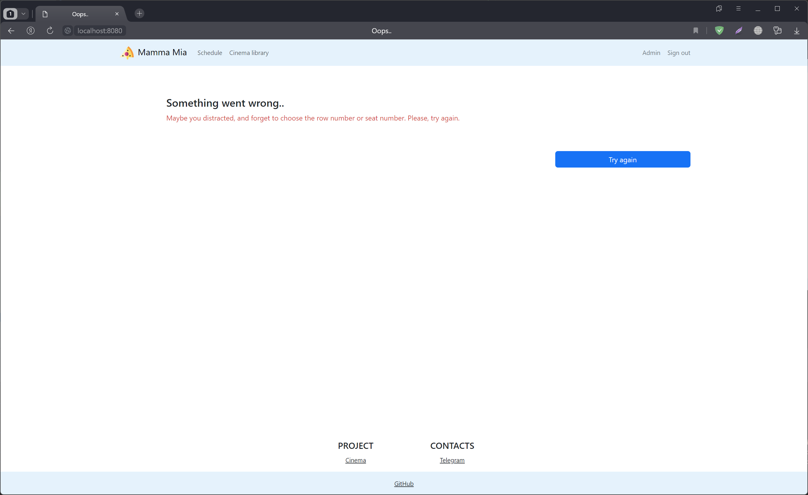
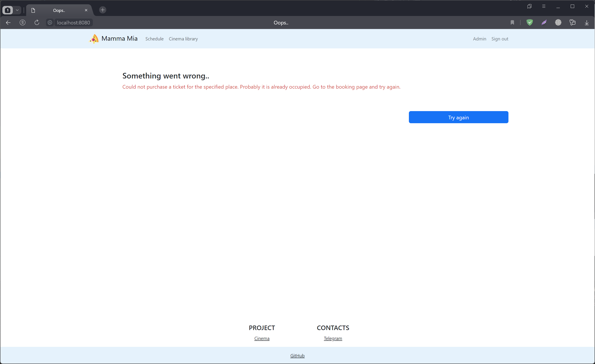

# job4j_cinema

About project.
--------------
This is website for buying tickets to the cinema. 
There are the schedule of sessions for each hall, film library (list of films with genre, year and age rating) on the website. 
If the User is registered, he can buy tickets. 
User can choose a specific place and row in the hall during the purchase of the ticket.

Tech stack.
--------------
- Java 17
- PostgreSQL 14
- Spring Boot
- Thymeleaf
- Bootstrap
- Liquibase
- Sql2o

Environment requirements.
------------------------
1. Java 17
2. Maven 3.8
3. PostgreSQL 14

Launching the project.
---------------------
1. Recommended Chrome based browser.
2. Install PostgreSQL: login - postgres, password - password;
3. Create cinema database;
> CREATE DATABASE cinema;
4. Build the project and run the Spring Boot application
> mvn clean package spring-boot:run

Application Interaction.
------------------------
------------------------
Main
----

Registration
------------

Login
-----

Library
--------

Schedule
-------

Buy ticket
----------

Success page
------------

Error pages
----------

Contacts.
--------
- Telegram - https://t.me/MAConsta.

